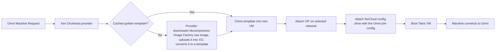

# Omni Infrastructure Provider for Xen Orchestra

A community infrastructure provider that lets [Sidero Omni](https://docs.siderolabs.com/omni/) create, scale, and delete [Talos Linux](https://www.talos.dev/) virtual machines on XCP-ng through [Xen Orchestra](https://xen-orchestra.com/).

> [!IMPORTANT]
> This project is community maintained and is not an official Sidero Labs or Vates product. It is an **alpha release**, ported from [omni-infra-provider-vergeos](https://github.com/kreove/omni-infra-provider-vergeos). Omni-driven cluster creation, scaling, node replacement and teardown have all been exercised against a live XCP-ng pool — see [Compatibility and limitations](docs/compatibility.md) for what that covered and what remains untested. It has been validated on one environment only, so try it in your own non-production environment first.

## Features

- Dynamic VM provisioning from Omni Machine Requests
- Clean scale-up, scale-down, and deprovisioning
- Automatic Talos Image Factory downloads, decompressed and imported into Xen Orchestra by the provider
- Image caching by Talos version, architecture, and Omni schematic, reused as a clonable golden template
- Omni-controlled system extensions and Talos versions
- Optional use of an existing Xen Orchestra template (manual override)
- NoCloud cloud-init join config delivery via a config drive the provider builds itself
- Docker Compose and Kubernetes deployment examples
- API-token or username/password authentication to Xen Orchestra

## How it works



Omni selects the Talos version and resolves the applicable system extensions into an Image Factory schematic. The provider converts that schematic into a `nocloud-amd64.raw.xz` URL, downloads and decompresses it itself (Xen Orchestra has no server-side URL-import equivalent to VergeOS's), uploads the raw disk into the configured Storage Repository, and turns it into a clonable template. Each machine is then created by fast-cloning that template's disk.

When Omni no longer needs a machine, the provider powers it off and removes its VIFs, disks, and VM. Shared cached golden templates are retained for reuse.

## Requirements

- An Omni instance with administrator access
- A Xen Orchestra instance managing an XCP-ng pool, reachable from the provider container
- Docker or Kubernetes to run the provider
- A dedicated Xen Orchestra API token (or username/password)
- DNS and HTTPS access from the provider container to the configured Talos Image Factory
- Network access from provisioned Talos VMs to the Omni endpoints required by your deployment
- `amd64` virtualization hosts (XCP-ng is x86-only)

The provider currently supports `amd64` only.

## Quick start

### 1. Register the provider in Omni

The service-account name must match the provider ID. The default provider ID is `xoa`.

```bash
omnictl infraprovider create xoa
```

Save the returned `OMNI_ENDPOINT` and `OMNI_SERVICE_ACCOUNT_KEY` values. **The key is shown only at creation and cannot be read back later from the Omni UI** — if you lose it, run `omnictl infraprovider renewkey xoa` to issue a new one.

You can also create the provider from **Settings → Infra Providers** in the Omni UI, which displays the key once in the creation dialog.

See [Installation](docs/installation.md#1-register-an-infrastructure-provider-in-omni) for details, including how to create the underlying `infra-provider:xoa` service account explicitly.

### 2. Create a Xen Orchestra account for the provider

Create a dedicated Xen Orchestra user and grant only the permissions the provider needs. Authenticate as that user with either an API token or a username and password.

Token creation is **not** under Settings in the XO UI — it lives on your own user page, and moves between XO versions. The version-independent way is the CLI, run as the provider's user:

```bash
xo-cli create-token https://xoa.example.com provider-user
```

See [Installation](docs/installation.md#2-create-a-xen-orchestra-account-for-the-provider) for the permission list and the username/password alternative.

### 3. Configure the provider

```bash
cp deploy/example.env deploy/.env
chmod 600 deploy/.env
```

Edit `deploy/.env`:

```dotenv
PROVIDER_IMAGE=ghcr.io/kreove/omni-infra-provider-xoa:VERSION
OMNI_ENDPOINT=https://omni.example.com
OMNI_SERVICE_ACCOUNT_KEY=replace-me
XOA_ENDPOINT=wss://xoa.example.com
XOA_TOKEN=replace-me
TALOS_IMAGE_FACTORY_BASE_URL=https://factory.talos.dev
```

### 4. Start the provider

```bash
cd deploy
docker compose up -d
docker compose logs -f omni-infra-provider-xoa
```

The provider exposes no listening port. It only makes outbound connections to Omni, Xen Orchestra, and the Talos Image Factory.

### 5. Create a Xen-Orchestra-backed Machine Class

In Omni, create a dynamic Machine Class using the registered Xen Orchestra provider. Paste provider data similar to:

```yaml
pool_id: "<xo-pool-uuid>"
sr_id: "<xo-sr-uuid>"
network_id: "<xo-network-uuid>"
architecture: amd64
cores: 4
memory: 8192
disk_size: 32
```

Do not set `template_id` when you want automatic Image Factory integration.

### 6. Create a cluster

Reference the Machine Class from the Omni UI or a cluster template:

```yaml
kind: Cluster
name: xoa-example
kubernetes:
  version: v1.36.1
talos:
  version: v1.13.2
systemExtensions:
  - siderolabs/xen-guest-agent
---
kind: ControlPlane
machineClass:
  name: xoa-control-plane
  size: 3
---
kind: Workers
name: workers
machineClass:
  name: xoa-workers
  size: 3
```

Validate and apply it:

```bash
omnictl cluster template validate -f cluster.yaml
omnictl cluster template sync -f cluster.yaml --verbose
omnictl cluster template status -f cluster.yaml
```

Use Talos and Kubernetes versions supported by your Omni release. The versions above are examples, not release requirements. Installing the `siderolabs/xen-guest-agent` system extension is recommended so Xen Orchestra reports the VM's IP addresses; see [Images and system extensions](docs/images-and-extensions.md).

## System extensions and image selection

You normally do **not** select a fixed installation template in Xen Orchestra. Configure `systemExtensions` in Omni instead. Omni generates a new schematic whenever the Talos version, extensions, or image-affecting configuration changes. The provider then imports or reuses the golden template required by that schematic.

See [Images and system extensions](docs/images-and-extensions.md).

## Documentation

- [Installation](docs/installation.md)
- [Configuration reference](docs/configuration.md)
- [Using the provider](docs/usage.md)
- [Images and system extensions](docs/images-and-extensions.md)
- [Troubleshooting](docs/troubleshooting.md)
- [Architecture and lifecycle](docs/architecture.md)
- [Compatibility and limitations](docs/compatibility.md)
- [Development and releases](docs/development.md)
- [Support](SUPPORT.md)
- [Security policy](SECURITY.md)
- [Contributing](CONTRIBUTING.md)

## Building from source

```bash
docker build --pull --no-cache \
  -t omni-infra-provider-xoa:local \
  .
```

Or use Go directly:

```bash
go mod tidy
go test ./...
go build -o _out/omni-infra-provider-xoa \
  ./cmd/omni-infra-provider-xoa
```

The required Go version is declared in `go.mod`.

## Release status

Ported from `omni-infra-provider-vergeos` and validated against a live XCP-ng pool managed by Xen Orchestra, driven by a real Omni instance:

- Golden-template build (download, decompress, upload, attach, convert-to-template) from a real Talos Image Factory image
- Template-cache reuse, including four concurrent Machine Requests sharing a single build
- VM creation by fast-cloning the template, with the boot disk resized and a VIF attached to the requested network
- Join-config delivery via a provider-built NoCloud config drive
- Talos booting, joining Omni, and forming a healthy Kubernetes cluster
- Creating and tearing down whole clusters, scaling machine sets up and down, and replacing individual nodes
- Deprovisioning that removes VIFs, disks and the VM, leaving cached templates intact

Getting there found and fixed several real incompatibilities between the Go SDK's assumptions, Xen Orchestra's API, and what Talos requires of a Xen guest — see [Compatibility and limitations](docs/compatibility.md#findings-from-live-validation), which is worth reading before deploying.

Still unexercised: Talos version upgrades and system-extension changes, the manual `template_id` override, provider and Omni restarts with machines in flight, and running against a non-admin Xen Orchestra account. See [Development and releases](docs/development.md#live-test-checklist).

## License

This project is licensed under the [Mozilla Public License 2.0](LICENSE).

The provider follows patterns from [omni-infra-provider-vergeos](https://github.com/kreove/omni-infra-provider-vergeos), which itself follows patterns from the Sidero Labs KubeVirt infrastructure provider, and uses the official [Xen Orchestra Go SDK](https://github.com/vatesfr/xenorchestra-go-sdk). See [NOTICE.md](NOTICE.md) for attribution.
