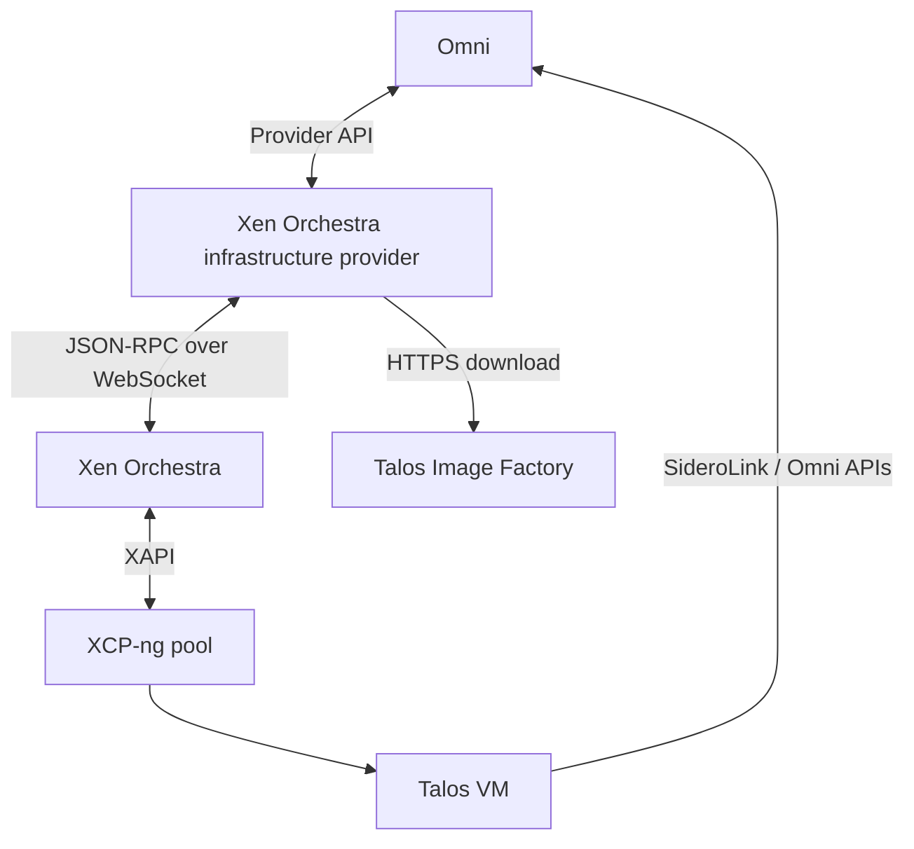
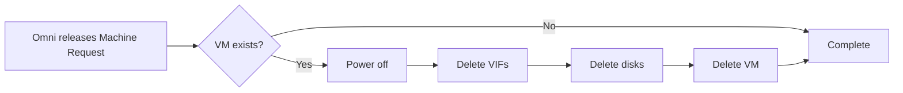

# Architecture and lifecycle

## Components

The provider is a stateless reconciliation service with a small amount of machine lifecycle state stored through Omni's infrastructure-provider framework.

## Provisioning steps

The provider registers these ordered steps:

1. `validateRequest`
2. `createSchematic`
3. `ensureTarget`
4. `ensureImage`
5. `syncMachine`

### `validateRequest`

- Validates the Machine Request name length.
- Decodes provider data.
- Applies defaults.
- Validates pool, storage repository, network, architecture, CPU, memory, and disk values.

### `createSchematic`

- Asks Omni to generate the Image Factory schematic.
- Adds console kernel arguments `console=ttyS0,38400n8 console=tty0`. `tty0` must come last so it owns `/dev/console`; XCP-ng HVM guests have no serial port, so a serial-only console discards all kernel output including panics.
- Records the schematic and Talos version in provider machine state.
- Requests a join-config workflow rather than embedding Omni connection parameters in the image.

### `ensureTarget`

- Confirms the Xen Orchestra pool exists.
- Confirms the storage repository exists.
- Confirms the network exists.

No VM is created until target validation succeeds.

### `ensureImage`

Manual mode:

- Reads the specified `template_id`.

Automatic mode:

- Builds the exact Image Factory raw image URL.
- Derives a deterministic cache name.
- Reuses a valid cached golden template or builds a new one.
- Stores the selected template ID in provider state.

Building a new golden template happens in a detached background goroutine (tracked per cache name in-process) so that a single step invocation doesn't block for the lifetime of a multi-gigabyte download. The step returns a short retry interval until the build completes. See [Images and system extensions](images-and-extensions.md) for the exact build sequence.

A per-process, in-memory build tracker reduces duplicate concurrent builds for the same cache name. This tracker is not distributed, which is why a single provider replica is recommended.

### `syncMachine`

- Finds the VM by Omni Machine Request ID (used as the VM's `name_label`).
- Creates the VM if missing: fast-clones the resolved golden/manual template's disk and attaches a VIF on the selected network.
- Builds a NoCloud config drive, uploads it as a VDI and attaches it, before the machine is ever powered on.
- Powers on the VM.

The VM receives:

- Omni Machine Join Config as `user-data` on a provider-built NoCloud config drive labelled `cidata`
- A minimal `networkConfig` (`version: 1\n`)

Network addressing is expected to come from the selected network, normally through DHCP.

## Idempotency

Repeated reconciliation uses deterministic identifiers:

| Resource | Identity |
| --- | --- |
| VM | Omni Machine Request ID as `name_label` |
| Boot disk | Cloned from the resolved template as part of VM creation |
| Primary VIF | Created on the selected network as part of VM creation |
| Config drive | Disk named `cidata` on the VM; rebuilt only if absent |
| Cached golden template | Deterministic `name_label` hash of the complete Image Factory asset URL |

If the provider restarts after partially completing an operation, it inspects Xen Orchestra and continues from the existing resources. Unlike VergeOS, boot disk and VIF creation happen atomically as part of `vm.create`, so there is no separate "ensure disk"/"ensure NIC" reconciliation step once the VM object exists — this is a deliberate simplification enabled by Xen Orchestra's richer VM-creation API.

## Deprovisioning

Cached golden templates are intentionally not deleted.

## Provider state

The machine state records:

- Xen Orchestra VM ID (a single UUID string — Xen Orchestra doesn't have VergeOS's split between a VM row key and an internal "machine" ID, so provider state is simpler here)
- Selected/built Xen Orchestra template ID
- Omni schematic ID
- Talos version

The generated protobuf resource follows the same broad pattern used by other Omni infrastructure providers.

## Security boundaries

- The Omni service-account key authorizes the provider to operate as its registered provider ID.
- The Xen Orchestra API token controls infrastructure access.
- Machine Join Config is written into a config drive image and uploaded to Xen Orchestra as a VDI attached to the machine.
- The provider itself downloads images from Image Factory (not Xen Orchestra server-side, unlike VergeOS) and uploads them into Xen Orchestra.
- The provider exposes no inbound network service.

Protect the Omni key and Xen Orchestra API token as high-value secrets.
